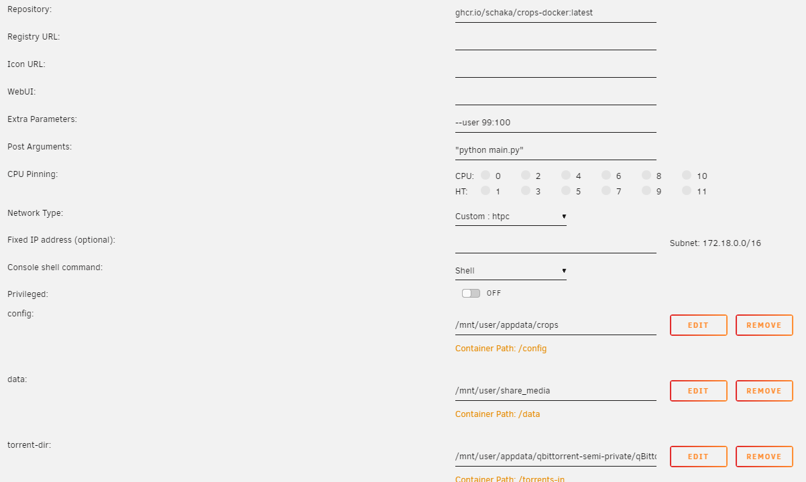

# Abandoned as of 04-08-2024
There are superior respositories out there in the form of both [kieraneglin's repo](https://github.com/kieraneglin/crops-docker) and **especially [Fertilizer](https://github.com/moleculekayak/fertilizer)** which is the spiritual successor of crops.
I recommend following either of these, as my image was just a quick and dirty solution to get it up and running.

# Docker image for crops
All I do is provide an Alpine based docker image for [crops](https://github.com/soranosita/crops).
The actual software does not change and you still have to supply the CLI commands yourself.

This can be done via docker-compose, Unraid or a simple Linux CLI command.

### Simple start
```sh
docker run ghcr.io/schaka/crops-docker:latest "python main.py"
```

### Config file
`$HOME` is mapped to `/config`. The image creates a symlink from `/config/settings.json` to `/app/settings.json` inside its `startup.sh`.
Grab the [settings file](https://github.com/soranosita/crops/blob/main/src/settings.json) and map it into the container as `/config/settings.json`.

### Run command
As per docs, the command work as follows:
`python main.py [-h] -i FOLDER_IN -o FOLDER_OUT (--ops-to-red | --red-to-ops) [--pth] [--download]`

For Unraid:
- ~Extra Parameters: `--user 99:100`~ currently only works as root, otherwise symlink can't be created
- Post Arguments: `"python main.py -i /torrents-in -o /data/torrent-watch --ops-to-red"` (yes, with double quotes)

See this config example screenshot where:
- Post arguments is `"python main.py [-h] -i FOLDER_IN -o FOLDER_OUT (--ops-to-red | --red-to-ops) [--pth] [--download]"`
- a `settings.json` is mapped into  `/config/setting.json`
- a `/data` dir to point towards for outputting `.torrent` files
- a `/torrent-in` dir, pointing to qbit's BT_backup to use as `FOLDER_IN`

